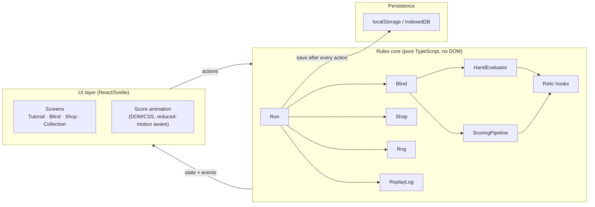
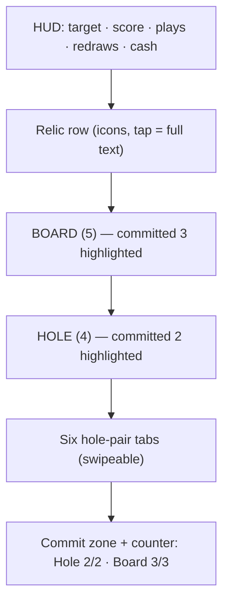

# DESIGN.md

# Super Omaha — Architecture Design

**Source of truth:** [scope.md](scope.md) · Behavior contract: [spec.md](spec.md)
**Status:** Draft v0.1

This document describes **how** the game is built: stack, modules, data flow, and the boundaries that keep Omaha rule logic testable and independent of presentation.

---

## 1. Stack

| Layer | Choice | Rationale |
|---|---|---|
| Language | TypeScript (strict) on **Deno 2** | Type-safe rules engine; shared types across UI, tests, and future server replay |
| UI | **Fresh 2** (Preact islands) | Islands architecture: the table is one hydrated island; the rest is static HTML. Decided at project init (supersedes "React or Svelte") |
| Build | Vite via `@fresh/plugin-vite` | Fast dev server, small bundles, PWA plugin |
| Delivery | PWA, self-hosted via **DONUT Deploy** (Fresh server behind nginx + systemd on Ubuntu) | No install, offline shell + last-run cache; vendored scripts in `deploy/` |
| Rendering juice | CSS/DOM first; Pixi/Phaser optional later | Scoring animation is DOM-feasible; a renderer is a Phase 3 juice layer, never the rules engine |

**Rejected:** Unity/Godot (overkill for a 2D card state machine), Phaser-as-rules-host (mixes rules with rendering).

---

## 2. Architecture overview

The system is a **pure rules core** wrapped by a **thin reactive UI**. The core is client-authoritative for feel; if leaderboards ever exist, a server replays the seed + action log.



**Boundary rule:** the rules core never imports from the UI layer and never touches the DOM, timers, or `Math.random()`. This makes golden tests, replay validation, and a future server port free.

---

## 3. Core modules

All modules live under `src/core/`. Names match scope.md §13.2.

### 3.1 `Deck`
- 52-card standard deck (or table-defined subset, e.g. Short deck's 36).
- Operations: `shuffle(rng)`, `draw(n)`, `burn(cards)`.
- Cards are immutable values: `{ rank, suit }` plus optional modifier tags (foil/steel/stone/holo).

### 3.2 `Hole` / `Board`
- Value holders for the 4 hole cards and 5 board cards.
- Track committed vs uncommitted cards per play so relics and UI can reference "unused" cards.

### 3.3 `HandEvaluator`
- Input: hole, board, active legality modifiers.
- Step 1 of the pipeline runs **before** enumeration: relics/boss rules may rewrite the legal shape (e.g. 3+2, 1+4).
- Enumerates all legal combos (default `C(4,2) × C(5,3) = 60`), classifies each, ranks by hand type then kickers among the 5 scored cards.
- Returns: best combo, full ranked list (for the six hole-pair tabs), and per-combo classification.
- Handles: ace-low wheel, wrap-straight rejection, flush+pair full house, board-paired quads with hole kickers.

### 3.4 `ScoringPipeline`
Implements the mandatory 8-step order from spec.md §5:

1. Apply legality modifiers → 2. Enumerate → 3. Classify → 4. Sum card chips → 5. On-card modifiers → 6. Relic flat/+mult/×mult in slot order → 7. After-score triggers → 8. Write replay log.

- Emits a **step list** (`{ step, label, chips, mult, total }[]`) consumed verbatim by both the animation layer and the replay log. One source of truth = no divergence between what the player saw and what the rules computed.

### 3.5 `Relic` interface

```ts
interface Relic {
  id: string;
  alterLegalCombos?(ctx: BlindContext): LegalityRule;   // runs pre-enumeration
  onStreet?(ctx: BlindContext): void;                    // post-MVP streets
  onScore?(ctx: ScoreContext): ScoreDelta;               // step 6, slot order
  onAfterScore?(ctx: ScoreContext): ScoreDelta;          // step 7 triggers
  onShop?(ctx: ShopContext): void;
  onBlindStart?(ctx: BlindContext): void;
}
```

- Relics are **data + hooks**, never free-form code patches. Execution order is deterministic: slot order for score effects.
- Boss modifiers implement the same hook surface with a distinct provenance tag.

### 3.6 `Blind`
- State: target, remaining plays, remaining redraws, cumulative score, active boss modifier.
- Transitions: `deal → (redraw | play)* → won | lost`.
- Emits events for UI (card dealt, commit, score step) and for `ReplayLog`.

### 3.7 `Shop`
- 3 item slots, 1 pack slot, 1 reroll (scaling cost), sell-back for relics.
- Inventory generated from `Rng` at shop entry — no timing exploits.

### 3.8 `Run`
- Owns ante progression (1–8 × Small/Big/Boss), money, relic slots (5), collection updates, win/lose.
- Serializes to a save blob after **every** action.

### 3.9 `Rng`
- Seeded PRNG (e.g. mulberry32/xoshiro over a string seed).
- Single instance threaded through all rules code; draw order is specified (deal, redraw, shop, pack) so replays are reproducible.

### 3.10 `ReplayLog`
- Append-only record of `{ action, rngCursor, stateHash, scoringSteps }`.
- Powers: debug downloads for failed blinds, determinism tests, future server-side leaderboard validation.

---

## 4. State management

- One store (framework-native: Redux Toolkit/Zustand for React, or Svelte stores) holding a **serializable run state tree**.
- UI dispatches semantic actions (`COMMIT_PLAY`, `REDRAW`, `BUY_ITEM`); the rules core reduces them and returns new state + events.
- No rules logic in components. Components render state and dispatch.

---

## 5. Determinism and replay

- Seed is generated at run start (or supplied for daily/challenge seeds).
- Every RNG draw is recorded with its cursor position.
- Determinism test: replay an action log from seed and assert identical final state hash.
- Daily seeds are client-only at MVP; validated leaderboards (server replay) are Phase 2.

---

## 6. Persistence design

| Data | Store | When written |
|---|---|---|
| In-progress run | IndexedDB | After every action |
| Settings (motion, audio) | localStorage | On change |
| Collection / meta | IndexedDB | On run end and on unlock |
| Guest profile | IndexedDB | On create |

- Save versioning: `version` field + migration function per version.
- PWA service worker caches the app shell and the last run for offline resume.

---

## 7. UI architecture

### Screens
`Title → Tutorial (first session) → Blind → Shop → … → RunEnd`, plus `Collection` and `Settings` from the title screen.

### Blind screen layout (portrait-first)


### Score theater
- The pipeline's step list drives a count-up animation: chips → +mult → ×mult → slam total.
- Reduced-motion setting swaps animation for instant values. This is an accessibility requirement, not a nicety.

---

## 8. Performance budget

| Budget | Target |
|---|---|
| First interactive paint | < 2s on mid-range mobile |
| Art payload | No multi-MB atlas at MVP (vector/geometric art) |
| Evaluator | 60 combos is trivial — do not optimize |
| Animation | 60fps scoring count-up |
| Viewport floor | 390×844, no horizontal scroll in shop |

---

## 9. Testing strategy

| Suite | Contents |
|---|---|
| Evaluator golden tests | Wheel, wrap-straight rejection, flush+pair boat, board-paired quads, 2+3 traps (board flush ≠ flush without 2 suited hole cards) |
| Pipeline fixtures | Relic ordering, legality-rewrite relics, after-score triggers |
| Boss fixtures | Every boss yields ≥ 1 legal play on Classic with no relics |
| Determinism | Seed + action log → identical state hash |
| Economy sims | Frequency-driven blind-target curve (Omaha inflates made hands — never copy Balatro's curve); median cash per ante |
| UI smoke | Portrait layout, commit legality gating, reduced-motion path |

Evaluator correctness bugs are launch blockers: they are reported as "the game cheated me."

---

## 10. Security / policy design constraints

- No cashier, wallet, withdrawal, or "buy chips" UI anywhere (gambling-policy flags).
- Chips are score, not currency-for-cash-out.
- Monetization hooks (cosmetics, optional account) are isolated behind feature flags and excluded from the MVP build.

---

## 11. Extensibility (designed now, built later)

- **Streets:** `Board` gains staged reveal + `onStreet` relic hooks — the pipeline already treats enumeration as modifier-driven.
- **New tables:** table = deck config + play/redraw budget + redraw scope; data-driven.
- **Server validation:** `ReplayLog` + seeded `Rng` are exactly what a replay validator needs; no core changes required.
- **Endless:** score type is arbitrary-precision (or display-capped) from day one.
